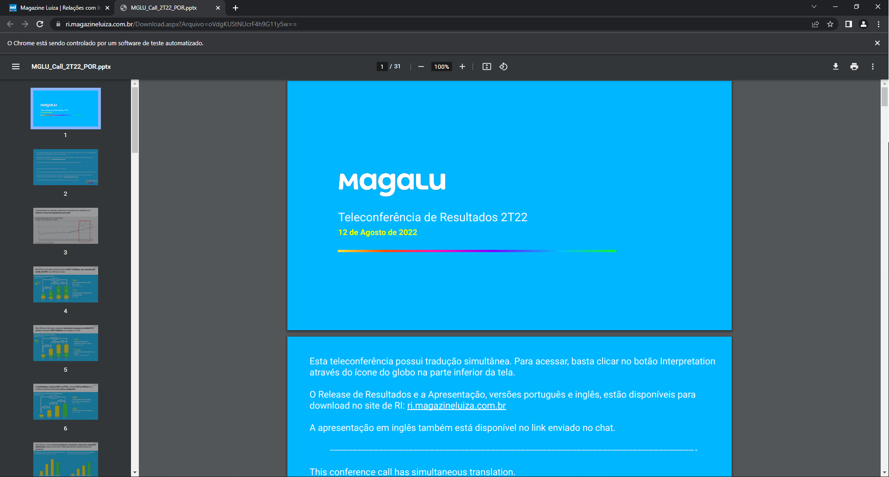

# Consultando a apresentação de resultados do grupo Magalu com automação Python utilizando a lib Selenium

<div align='center'>
  
</div>

O script escrito em Python automatiza o processo de abrir a página web de relações com investidores do grupo Magalu (Magazine Luiza) e acessar a apresentação de resultados do semestre mais recente. Os passos seguidos na automação são:

- Abrir janela do navegador
- Maximizar a janela
- Acessar a página web https://ri.magazineluiza.com.br/
- Clicar no link que acessa a apresentação de resultados

Para executar o script deve-se seguir os seguintes passos:

- Ter o Python instalado localmente
- Ter o Selenium instalado localmente
  ```bash
  pip install selenium
  ```
- Ter o executável do chromedriver no mesmo diretório em que o Python está instalado
- Executar no terminal o script riMaglu.py
  ```bash
  python riMaglu.py
  ```

